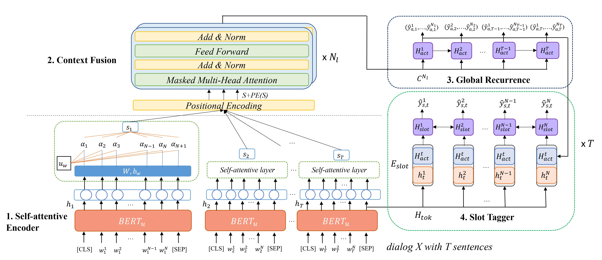
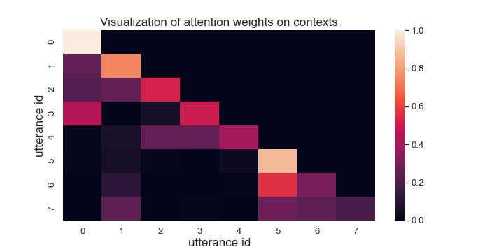

# Context-Aware Hierarchical BERT Fushion Network for multiple dialog act detection (CaBERT-SLU)

* This repository provides the code for training and inferencing the CaBERT-SLU framework with datasets MDC and SGD.
* A simple pytorch implementation of CaBERT-SLU and other baseline models.
* State-of-the-art results for joint multi dialog act and slot predictions in SLU (Until Aug 2021).
* The paper is available here: https://www.isca-speech.org/archive/interspeech_2021/wu21d_interspeech.html and was presented at [Interspeech 2021](https://www.interspeech2021.org/).

---



In this work, we present a context-aware hierarchical BERT fusion network (CaBERT-SLU) to exploit dialog history for joint dialog act detection and slot tagging tasks for spoken language understanding.

Simply, CaBERT-SLU will extract both utterance and turn-level information to identify multiple dialog acts and exploit a slot tagger to predict slots during the entire dialog. It achieves state-of-the-art performance (until June 2021) over several competitive baseline models.

## Visualization:



Example of utterance attention visualization for a dialog.

---


## Dataset

1. Microsoft Dialogue Challenge (E2E): (Provided in raw_datasets/)

   https://github.com/xiul-msr/e2e_dialog_challenge

2. The Schema-Guided Dialogue Dataset
   
   https://github.com/google-research-datasets/dstc8-schema-guided-dialogue

   Download the dataset by cloning the repository in raw_dataset/


## TO USE: Training/Testing

1. To train
    >
        python bert_context.py train

2. To test: select mode in `config.py`: data/validation
    >
        python bert_context.py test 

3. To visualize:

    bert_model_context.py will return ffscores and store it as a list of size (batch, head, time_step, time_step) tensors. <br>
    The length of list is the number of total attention layers.

## Baselines

1. MIDSF:
    >
        python baseline_midsf.py train

2. ECA:

    Change model to ECA
    >
        python bert_context.py train

## Parse Data (Optional: data is provided in data/)

1. Go to data/
2. Run the following command to create parsed data
    >
        python dialogue_data.py


If you use these models, please cite the following paper:
```
@inproceedings{wu21d_interspeech,
  author={Ting-Wei Wu and Ruolin Su and Biing-Hwang Juang},
  title={{A Context-Aware Hierarchical BERT Fusion Network for Multi-Turn Dialog Act Detection}},
  year=2021,
  booktitle={Proc. Interspeech 2021},
  pages={1239--1243},
  doi={10.21437/Interspeech.2021-95}
}
```

    
